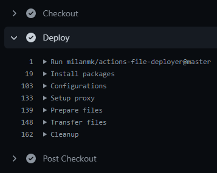

# FTP/SFTP file deployer

Fast and customizable deployment with parallel connections and proxy support. Deploy only changed files or do full sync/mirror of repository content.

This is a composite GitHub Action (Linux runner) for deploying repository content to remote server.

## Features

- Support for FTP and SFTP (SSH) protocols
- Use password or SSH private key for authentication of SFTP connection
- Delta file synchronization for faster deployment of only changed files since last revision
- Mirroring feature to copy entire file and folder structure of repository content
- Optimized for faster file transfers via parallel connections
- Connect to remote server via [SOCKS proxy](https://en.wikipedia.org/wiki/SOCKS) using [SSH tunneling](https://www.ssh.com/academy/ssh/tunneling) to bypass firewall / NAT / IP whitelist / VPC
- Uses [composite action](https://docs.github.com/en/actions/creating-actions/about-actions#types-of-actions) without Docker container for faster deployments and shorter run time
- Pass additional command arguments to SSH and FTP client for custom configurations and settings
- Step runs messages categorized nicely in log groups
- Run additional FTP commands after synchronization



## Usage

```yml
- name: "Checkout"
  uses: actions/checkout@v2
  with:
    fetch-depth: 0
- name: "Deploy"
  uses: milanmk/actions-file-deployer@master
  with:
    remote-protocol: "sftp"
    remote-host: "ftp.example.com"
    remote-user: "username"
    ssh-private-key: ${{ secrets.DEPLOY_PRIVATE_KEY }}
    remote-path: "/var/www/example.com"
```

Workflow example `.github/workflows/main.yml`.

```yml
name: Deploy Files

on:
  push:
    branches:
      - master
  # Enables manually triggering of Workflow with file synchronization option
  workflow_dispatch:
    inputs:
      sync:
        description: "File synchronization"
        required: true
        default: "delta"

jobs:
  deploy-master:
    name: "master branch"
    if: ${{ github.ref == 'refs/heads/master' }}
    runs-on: ubuntu-latest
    timeout-minutes: 30
    steps:
      - name: "Checkout"
        uses: actions/checkout@v2
        with:
          fetch-depth: 0
      - name: "Deploy"
        uses: milanmk/actions-file-deployer@master
        with:
          remote-protocol: "sftp"
          remote-host: "ftp.example.com"
          remote-user: "username"
          ssh-private-key: ${{ secrets.DEPLOY_PRIVATE_KEY }}
          remote-path: "/var/www/example.com"
```

## Inputs

| Name                   | Required             | Default | Description                                   |
|------------------------|----------------------|---------|-----------------------------------------------|
| remote-protocol        | yes                  | sftp    | Remote file transfer protocol (ftp, sftp)     |
| remote-host            | yes                  |         | Remote host                                   |
| remote-port            | yes                  | 22      | Remote port                                   |
| remote-user            | yes                  |         | FTP/SSH username                              |
| remote-password        | no                   |         | FTP/SSH password                              |
| ssh-private-key        | no                   |         | SSH private key of user                       |
| proxy                  | yes                  | false   | Enable proxy for FTP connection (true, false) |
| proxy-host             | yes (if proxy: true) |         | Proxy host                                    |
| proxy-port             | yes (if proxy: true) | 22      | Proxy port                                    |
| proxy-forwarding-port  | yes (if proxy: true) | 1080    | Proxy forwarding port                         |
| proxy-user             | yes (if proxy: true) |         | Proxy username                                |
| proxy-private-key      | yes (if proxy: true) |         | Proxy SSH private key of user                 |
| local-path             | yes                  | .       | Local path to repository                      |
| remote-path            | yes                  | .       | Remote path on host                           |
| sync                   | yes                  | delta   | File synchronization (delta, full)            |
| ssh-options            | no                   |         | Additional arguments for SSH client           |
| ftp-options            | no                   |         | Additional arguments for FTP client           |
| ftp-mirror-options     | no                   |         | Additional arguments for mirroring            |
| ftp-post-sync-commands | no                   |         | Additionnal FTP command to run after sync     |
| webhook                | no                   |         | Send webhook event notifications              |
| artifacts              | no                   | false   | Upload logs/files to artifacts (true, false)  |
| debug                  | no                   | false   | Enable debug information (true, false)        |

### Notes

- Character support for `remote-user` and `remote-password` is limited due to its usage in [.netrc file](https://www.gnu.org/software/inetutils/manual/html_node/The-_002enetrc-file.html)
  - It should not contain shell/URL special characters
- File synchronization options
  - `delta`: Transfer only changed files (upload and delete) since last revision
    - Only supported for `push`, `pull_request` and `workflow_dispatch` [events](https://docs.github.com/en/actions/reference/events-that-trigger-workflows)
    - Requires `fetch-depth: 0` option in [checkout action](https://github.com/actions/checkout)
    - It is recommended to initially do a full synchronization and then switch to delta
  - `full`: Transfer all files (upload)
    - Does not delete files on remote host
    - Default glob exclude pattern is `.git*/`
- For `ftp-options` and `ftp-mirror-options` command arguments please refer to [LFTP manual](https://lftp.yar.ru/lftp-man.html)
- `ftp-post-sync-commands` can be used to run additional LFTP commands after the
    synchronization. For example, to upload a file watched by a process manager
    on the server in order to restart a deamon:
    ```
    ftp-post-sync-commands: |
      !touch watched_file
      put watched_file
    ```
- Setting `webhook` to a URL will send start and finish event notifications in JSON format
  - start event payload:
  ```
  {
    "timestamp": "1234567890",
    "status": "start",
    "repository": "owner/repository",
    "workflow": "workflow name",
    "job": "deploy",
    "run_id": "1234567890",
    "ref": "refs/heads/master",
    "event_name": "push",
    "actor": "username",
    "message": "commit message",
    "revision": "da39a3ee5e6b4b0d3255bfef95601890afd80709"
  }
  ```
  - finish event payload:
  ```
  {
    "timestamp": "1234567890",
    "status": "finish",
    "repository": "owner/repository",
    "workflow": "workflow name",
    "job": "deploy",
    "run_id": "1234567890",
    "ref": "refs/heads/master",
    "event_name": "push",
    "actor": "username",
    "message": "commit message",
    "revision": "da39a3ee5e6b4b0d3255bfef95601890afd80709"
  }
  ```
- Enabling `artifacts` will upload transfer log and modified files to artifacts
  - Modified files are only added for delta file synchronization
- Enabling `debug` option will output useful context, inputs, configuration file contents and transfer logs to help debug each step
- It is strongly recommended to use [Encrypted Secrets](https://docs.github.com/en/actions/reference/encrypted-secrets) to store sensitive data like passwords and private keys

## Planned features

- [x] Add transfer log to artifacts
- [x] Add modified files to artifacts
- [ ] Add steps logging to file
- [ ] Add steps log to artifacts
- [x] Trigger webhook at start and end of step runs
